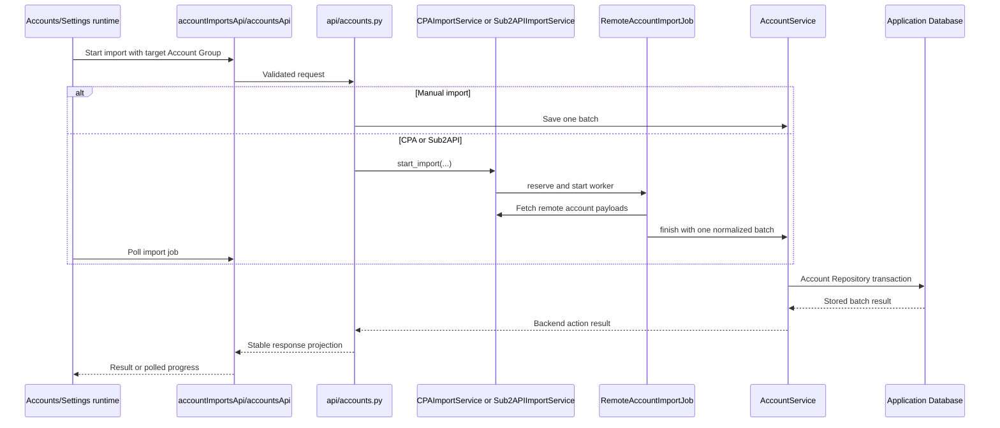
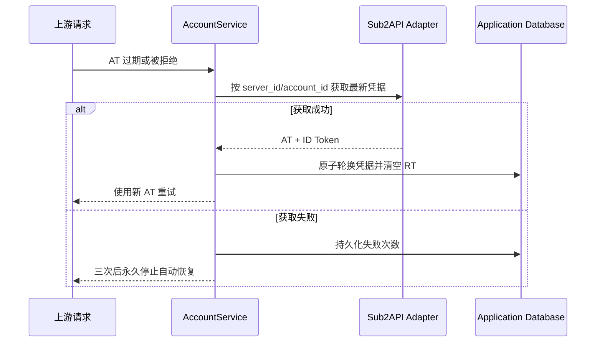
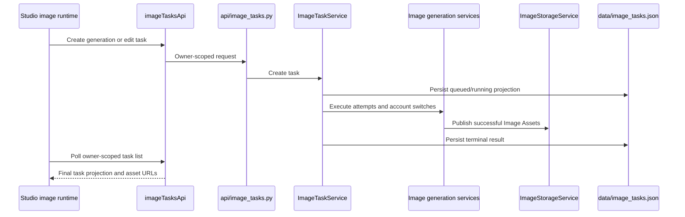
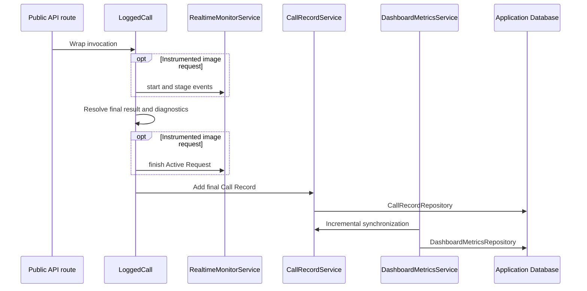
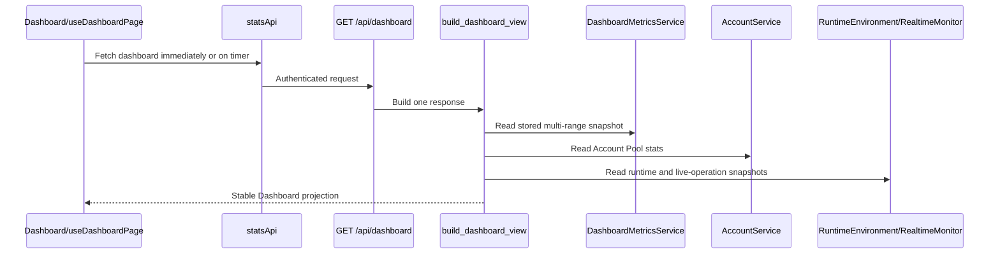
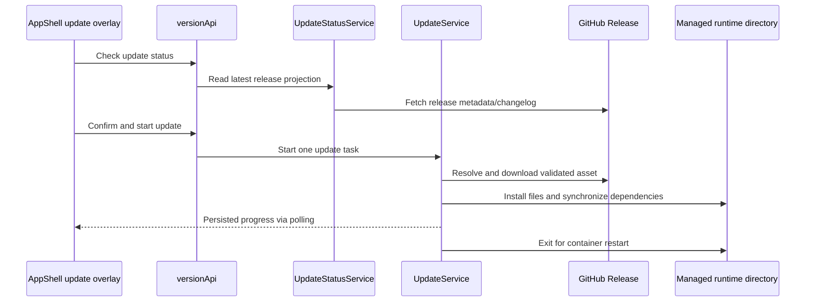

# Critical Flows

Status: current

These sequences identify the lifecycle owner and handoff points for workflows
that cross multiple Modules. They are navigation maps, not substitutes for
contracts or implementation.

## Account import

Manual JSON/credential import writes through the account API and
`AccountService`. CPA and Sub2API use one shared remote-job lifecycle.

`RemoteImportJobCoordinator` enforces the shared active-job rule. Both remote
sources finish through `RemoteAccountImportJob.finish`; source adapters do not
implement a second save lifecycle. The UI owns polling and presentation only.

### Sub2API 凭据恢复

Sub2API 导入只持久化 AT、ID Token 和远端来源绑定，不保存 RT。AT 已过期或被上游拒绝时，`AccountService` 通过 `Sub2APIImportService` 绑定的恢复 Adapter 按来源账号重新读取凭据；失败次数逐次持久化，累计三次后永久停止，手工重新导入同一来源账号会轮换 AT 并重置状态。

## Studio Image Task

`ImageTaskService` owns task admission, transitions, attempts, resumption, and
terminal state. `ImageStorageService` exclusively owns Image Asset catalogue and
storage mutations. Studio owns browser conversation presentation and polling,
not task truth.

## Call Record, live monitor, and metrics

The Call Record is durable final truth. Active Requests and live operations are
process-memory observations and may disappear on restart. The Dashboard Metric
Projection reads only Call Records after its stored sequence during normal
synchronization, updates affected hourly rows atomically, and rebuilds only when
an explicit repository operation rotates the Call Record generation or an
aggregate table is structurally incompatible. User-facing log deletion and
automatic retention preserve the cursor, so the 30-day history remains
independent of the shorter Call Record retention window. If only the projection
state table is recreated, startup checkpoints the current cursor without
deleting compatible hourly aggregates.

## Dashboard projection

The backend owns metric definitions, available ranges, units, health, and
runtime values. Account cards and Active Request counts read current state;
24-hour call cards and all chart ranges come from the same 30-day hourly
projection; runtime-environment samples are not persisted. The page selects one
returned range and owns refresh timing, retained snapshots, chart construction,
animation, layout, and responsive behavior.

## Managed-container online update

`UpdateService` owns the complete update task and rejects unsupported runtime
modes. The frontend only confirms, starts, polls, and renders progress. Update
task state is persisted in `data/update_task.json`; the container runtime owns
restarting the process after exit.
